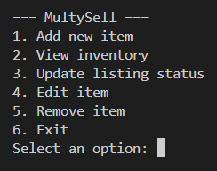
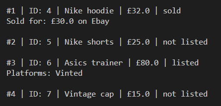
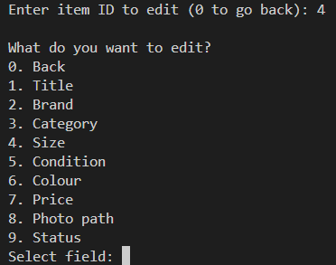

# MultySell – Resale Inventory Made Simple

A Python-based command-line application designed to help manage and track clothing resale listings across multiple platforms.

This project was built to solve a real-world problem by creating a central system to organise inventory, manage listings, and track sales in a simple and efficient way.

---

## Features

- Add and store resale items with detailed attributes  
- View inventory in a clean, structured format  
- Update listing status (not listed, listed, sold)  
- Track platforms where items are listed  
- Record sold price and platform  
- Edit item details (price, condition, etc.)  
- Remove items (restricted for sold items to preserve history)  
- Input validation for numeric fields  
- Navigation system with "back" functionality across menus  

---

## Screenshot (Main Menu)

---

## Screenshot (Inventory View)

---

## Screenshot (Item Workflow)

---

## Technologies Used

- Python  
- SQLite  
- VS Code  
- Git & GitHub  

---

## How to Run

1. Clone the repository  
2. Navigate into the project folder  
3. Create a virtual environment:

   python -m venv .venv  

4. Activate the environment  

   Windows:  
   .venv\Scripts\Activate  

   Mac:  
   source .venv/bin/activate  

5. Run the application:

   python src/main.py  

---

## Example Workflow

1. Add an item with details such as title, brand, and price  
2. Mark the item as listed and specify platforms (e.g. Vinted, Depop)  
3. Update price or details if needed  
4. Mark the item as sold and record final price and platform  
5. Track all inventory and sales from one place  

---

## Future Improvements

- Listing export (copy-ready text for each platform)  
- Inventory sorting and filtering  
- Profit tracking and analytics  
- Improved CLI styling  
- Potential GUI or web-based version  

---

## End

I hope this tool helps simplify your resale workflow :)